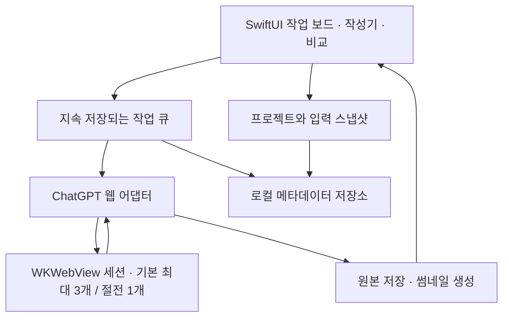

# GPT Image Flow — 제품·UX·구현 계획

작성: 2026-09-19. 구현 현황 갱신: 2026-09-20. 상태: 0.2 캔버스·병렬·후속 응답 워크플로 구현. 제품명은 가칭.

현재 구현 범위와 검증은 [V02_WORKFLOW.md](docs/V02_WORKFLOW.md)를 참조한다. 이전 알파 검증은 [ALPHA_VALIDATION.md](docs/ALPHA_VALIDATION.md)에 보존한다. 아래 계획은 제품 전체의 목표와 단계별 수용 기준을 보존한다.

사용자 요청에 따라 서비스 한도 부하 테스트는 수행하지 않고 ChatGPT Endless Canvas의 고정 커밋을 운영 설정의 근거로 채택했다. 최신 검증 결과와 증거 수준은 [PREFLIGHT_REPORT.md](docs/PREFLIGHT_REPORT.md), 설정 원본은 [generation-policy.json](config/generation-policy.json)을 따른다.

## 1. 목표와 현재 판단

목표는 ChatGPT Pro를 사용하는 디자이너가 공통 브리프와 참조 이미지를 한 번 준비한 뒤, 여러 시안을 생성하고 비교·수정·선정·내보내는 과정을 한 작업 공간에서 끝내는 macOS 앱이다.

핵심 가치 지표는 이미지 생성 수보다 **쓸 만한 최종안을 얻기까지 사용자가 직접 조작하는 시간**이다. 모델의 생성 대기 시간과 앱의 조작 시간을 분리해 측정한다.

WKWebView를 첫 구현 엔진으로 채택한다. 사용자 제공 보고서, upstream 코드 감사, 로컬 첨부·다운로드·결과 선택·스케줄링·강제 종료 복구 시험을 근거로 한다. 구현 전에는 실제 ChatGPT 로그인·이미지 생성을 재실행하지 않았다. 이후 사용자 승인으로 로그인·생성·참조 수정·배치 총 5건을 제품 앱에서 검증했다. 장시간 동작과 지원 OS 확대는 후속 수용 기준으로 유지한다.

Git 저장소, 생성 정책, 검증 전용 Swift 패키지에 이어 제품 UI, 실제 생성 어댑터, 저장·복구·비교·내보내기를 구현했다. 레시피 관리, 대규모 라이브러리 성능, 배포 준비 등 아래 계획의 모든 항목이 끝난 것은 아니다.

잠정 제품 범위:

- Apple Silicon, macOS 14 deployment target으로 시작한다. 최소 OS에서의 실제 실행 호환성은 Beta에서 확인한 뒤 지원 버전을 확정한다.
- 개인 디자이너, 단일 ChatGPT 계정, 로컬 프로젝트를 우선한다.
- 대표 사용 사례는 브랜드·마케팅 시안이다. 캐릭터·제품 시리즈도 공통 참조 기능으로 지원하되 일관성을 보장한다고 표현하지 않는다.
- 첫 배포는 Developer ID 서명·공증을 거친 직접 배포를 목표로 한다. App Store 적합성은 별도 검토 대상이다.
- 사용자는 웹뷰에서 직접 로그인한다. 앱은 계정 비밀번호를 별도로 받지 않는다.

## 2. 보고서에서 채택할 것과 다시 검증할 것

| 보고서의 근거 | 계획에서의 해석 및 조치 |
| --- | --- |
| 로그인, 프롬프트 전송, 이미지 저장 성공 | WKWebView를 우선 후보로 채택한다. 지원 OS·로그인 방식별 재현은 필요하다. |
| 한 차례 재실행 후 로그인 유지 | 지속 저장 가능성의 근거다. 영구 세션을 의미하지 않으며 만료·로그아웃 복구를 구현한다. |
| 최소화 후 5초 타이머 동작 | 새 로컬 시험에서 숨김 시 250ms 타이머가 10초간 10회 실행됐다. 고정 속도 가정을 제거하고 네이티브 watchdog·복귀 시 재확인을 사용한다. |
| 전체 약 350 MB 측정 | PoC 기준점으로 사용한다. 이미지 라이브러리와 반복 작업이 추가된 제품의 수치로 약속하지 않는다. |
| 참조 파일 업로드 근거 없음 | 새 로컬 WKWebView 시험에서 단일·다중·반복 첨부와 3개 웹뷰 분리를 확인했다. 실제 ChatGPT 서버 업로드 완료 판정은 첫 통합에서 확인한다. |
| 이미지 완료를 버튼·해상도·URL 안정성으로 판단 | 보조 신호로 사용한다. 반드시 이번 요청의 새 응답에 속하는 이미지인지 함께 확인한다. |
| 특정 추론 설정과 내부 모델 메타데이터의 대응 | 해당 실험의 관찰로 보존한다. Flare/Sunburst를 고정 모델 선택이나 품질 보장으로 제품에 노출하지 않는다. |
| Base64 전송을 디스크 스트리밍으로 설명 | 소스는 Blob→ArrayBuffer→문자열→Base64→Swift Data를 거친다. 여러 메모리 복사이며 직접 스트리밍이 아니다. 다운로드 경로를 별도 평가한다. |
| Chrome 대비 메모리 우위 | 동일 머신·작업·이미지 수·워커 수로 다시 비교한다. 현재 수치만으로 배수 우위를 홍보하지 않는다. |

패스키 제한도 보고서의 테스트 환경 관찰로 취급한다. 모든 WKWebView·OS 조합에 대한 영구적 결론으로 확대하지 않는다.

구독 이미지 사용 권한과 공식 API 사용 권한은 구분한다. 공식 이미지 API에는 별도 가격 체계가 있으며, 검토한 공식 문서에서 이 앱이 Pro 이미지 혜택을 사용하는 공개 통합 API는 확인하지 못했다. 따라서 웹 UI 연동을 공식적으로 보장된 API처럼 취급하지 않는다. 공개 배포 전에 현행 서비스 조건과 허용되는 통합 범위를 확인하는 것은 제품 출시 조건으로 남긴다. API 전환은 비용 구조를 바꾸므로 자동 대체하지 않는다.

## 3. 경쟁 비교와 차별화 가설

비교 및 운영 설정의 기준은 [ManiacMike/chatgpt-endless-canvas](https://github.com/ManiacMike/chatgpt-endless-canvas)의 `7783f02518d3d1878f3729e80b8499fb566d15e9` 커밋이다.

이 저장소에는 무한 캔버스, 참조 기반 생성, 주석 수정, 배치, 기본 3개 병렬 워커, 계보, 중단 작업 복구가 이미 있다. 코드까지 확인했으며 3개는 공식 서비스 상한이 아니다. 따라서 이 기능들의 존재만으로는 차별화할 수 없다. 실제 사용성·성능 우위는 아직 측정하지 않았다.

| 차별화 가설 | 구체적인 제품 선택 | 검증 방법 |
| --- | --- | --- |
| 준비를 반복하지 않는다 | 프로젝트 브리프·참조 세트·생성 레시피 재사용 | 5개 시안 준비 시 재첨부·재입력 횟수 |
| 좋은 결과를 빨리 고른다 | 자동 정렬, 2~4개 비교, 후보 표시, 변경점 표시 | 비교·선정 완료까지의 조작 시간 |
| 수정 맥락을 잃지 않는다 | 원본과 수정본 연결, 입력 스냅샷, 차이 강조 | 지난 시안의 설정을 다시 찾는 성공률 |
| 설치와 일상 사용이 가볍다 | 네이티브 앱, 필요할 때만 활성화되는 웹뷰 | 첫 생성까지 설정 단계, 전체 메모리·CPU |
| 중단 후 신뢰할 수 있다 | 저장된 큐, 결과 재수집, 불확실한 전송의 재확인 | 결과 유실·중복 생성·잘못된 결과 연결 건수 |

## 4. 핵심 UX

### 4.1 기본 화면

메인 윈도우는 사이드바·작업 보드·접을 수 있는 인스펙터로 구성한다. 하단 또는 선택한 생성 묶음에 연결된 작성기를 두며, 작업 큐는 평소 한 줄 상태로 접고 필요할 때 펼친다.

| 영역 | 내용과 역할 |
| --- | --- |
| 사이드바 | 프로젝트, 최근 작업, 즐겨찾기. 기본 macOS 목록 밀도와 선택 동작 유지 |
| 중앙 작업 보드 | 생성 묶음별 결과를 자동 정렬. 선택·다중 선택·확대·비교·후보 지정 |
| 작성기 | 요청, 참조 이미지, 변형 목록, 생성 개수. `⌘↩`로 실행 |
| 인스펙터 | 선택 이미지의 실제 사용 프롬프트, 참조, 설정, 부모 결과, 원래 대화 |
| 큐 표시 | 준비·업로드·생성·저장·주의 필요. 대기 작업 순서 변경과 제거 |

13인치 화면에서는 인스펙터를 기본 접고 작성기 높이를 제한한다. 다크 모드·고대비·키보드 탐색·VoiceOver를 기본 동작에 포함한다. 재질과 색상은 시스템 설정을 따른다. 장식보다 이미지 면적과 선택 상태의 명확함을 우선한다.

첫 버전은 정렬된 보드가 기본이다. 자유 배치가 탐색에 유리한지 사용자 테스트로 확인한 뒤, 같은 작업·이미지 데이터를 사용하는 추가 보기로 확장한다. 배치 좌표를 핵심 데이터 모델에 결합하지 않는다.

### 4.2 대표 작업: 참조 한 번으로 시안 5개 만들기

1. 프로젝트에 로고·제품·스타일 참조를 드래그한다. 앱은 관리 저장소로 복사해 원본 파일 이동의 영향을 줄인다.
2. 공통 브리프를 입력한다. 예: “이 제품을 중심으로 여름 캠페인 키비주얼”.
3. 동일 요청 반복 또는 변형 목록을 선택한다. 예: 해변 / 스튜디오 / 야간 / 미니멀 / 자연광.
4. 전송 전 각 작업의 참조 썸네일과 최종 요청을 확인할 수 있다. 일반 실행에 매번 확인 모달을 요구하지 않는다.
5. ‘5개 생성’을 한 번 누르면 즉시 자리표시자 5개가 생긴다. 큐는 전송 간격을 지키며 기본 최대 3개, 절전 모드 1개를 실행한다. 생성 중 다른 브리프를 작성하거나 기존 결과를 비교할 수 있다.
6. 결과 2개를 선택해 같은 확대 비율로 비교한다. 규격이 다르면 맞춤 보기로 전환한다.
7. 하나를 선택해 “배경을 밝게, 제품과 구도 유지”처럼 수정한다. 수정본은 부모 아래 같은 묶음에 나타난다.
8. 후보를 Finder나 실제로 지원되는 디자인 앱으로 드래그하거나, 이름 규칙을 적용해 폴더로 내보낸다.

드래그 대상 앱의 파일 수용 여부는 실제 앱별로 확인하며 범용 연동을 보장하지 않는다. PNG/JPEG/WebP 등 원본은 원래 형식으로 보존하고 내보내기 변환은 명시적으로 선택한다.

### 4.3 참조와 맥락을 다루는 규칙

- 참조 이미지는 ‘제품’, ‘스타일’, ‘구도’ 같은 역할을 선택할 수 있다. 역할은 요청 작성에 반영되는 지시이며 모델의 하드 제약은 아니다.
- 적용 우선순위는 프로젝트 기본값 → 생성 묶음 → 개별 작업이다. 상속한 항목과 변경한 항목을 구별해서 표시한다.
- 실행 시 프롬프트·참조 파일 해시·설정·부모 결과를 고정한다. 이후 프로젝트 기본값을 바꿔도 이미 제출한 작업은 바뀌지 않는다.
- ‘설정 재사용’은 입력 재사용이며 동일 이미지 재현을 약속하지 않는다.
- 독립 시안은 독립 대화로 생성한다. 기존 ChatGPT Memory·개인화의 영향까지 완전히 배제된다고 표현하지 않는다.
- MVP 수정은 선택 결과와 필요한 참조·브리프를 새 요청에 명시적으로 넣는다. 앱의 부모·자식 관계와 ChatGPT의 대화 분기 기능은 구분한다.
- 원래 대화에서 계속 수정하는 방식은 맥락 누적과 복구 검증 후 추가한다.
- 품질/비율 설정은 실제 웹 UI에서 확인된 기능만 노출한다. 프롬프트 지시로만 가능한 비율은 그렇게 표시하며 정확한 크기를 보장하지 않는다.

### 4.4 실패 상황도 기본 UX에 포함

| 상황 | 사용자에게 보이는 동작 |
| --- | --- |
| 로그인 만료 | 큐와 작업 내용을 유지하고 로그인 패널 표시. 재인증 후 상태를 확인해 재개 |
| 첨부 실패 | 해당 파일과 원인을 표시. 참조 없이 조용히 전송하지 않음 |
| 서비스 사용 제한 | 새 작업 전송을 멈춤. 서비스가 제공한 대기 정보만 표시 |
| 전송 직후 연결 끊김 | ‘전송 여부 확인 중’. 기존 대화를 확인하기 전 자동 재전송하지 않음 |
| 생성 완료 후 저장 실패 | 결과 수집·저장만 재시도. 이미지를 다시 생성하지 않음 |
| 이미지 대신 텍스트/추가 질문 | 해당 응답을 보여주고 요청 수정 또는 대화 열기로 연결 |
| 앱 재실행·잠자기 복귀 | 저장된 작업과 대화의 상태를 대조한 뒤 재개 |
| 웹 UI 구조 변경 | 해당 기능의 실행을 멈추고 읽기·비교·내보내기는 계속 제공 |

‘일시정지’는 다음 작업 전송을 중단한다. ‘현재 생성 중단’은 별도 동작이며 원격 중단 확인 전 성공했다고 표시하지 않는다. 앱 종료 중에는 로컬 워커가 실행되지 않는다. 원격 생성이 계속되었는지는 재실행 시 확인한다.

### 4.5 macOS 사용성

- `⌘N` 새 프로젝트, `⌘↩` 생성, Space 미리보기, `⌘Z` 되돌리기, 표준 다중 선택·컨텍스트 메뉴.
- 생성 명령의 되돌리기는 이미 보낸 원격 요청을 취소하는 것으로 해석하지 않는다. 참조 추가·보드 정리·로컬 편집 등 되돌릴 수 있는 동작에 적용한다.
- Finder 파일 드롭, 붙여넣기, 여러 결과 내보내기, 창 크기·선택 복원.
- 설정은 별도 Settings 창. 로그인/복구에 쓰는 웹 패널은 사용자가 열 수 있게 유지.
- 완료 알림은 요청된 묶음 단위로 제공하고, 포그라운드 작업 중에는 과도하게 띄우지 않는다.

## 5. 기술 구조

SwiftUI를 기본 UI로 사용하고 WKWebView, 파일 패널, 고급 드래그 동작에만 작은 AppKit 경계를 둔다. 기본 레이아웃은 `NavigationSplitView`, 앱 진입은 `WindowGroup`, 설정은 `Settings`를 사용한다.



### 5.1 소유권과 모듈

- 앱 범위: 계정 세션, 최대 3개 워커 풀, 스케줄러, 자산 저장소. 프로젝트를 여러 창으로 열어도 워커를 창마다 만들지 않는다. 계정 전체 전송 간격은 30~120초로 관리한다.
- 창 범위: 현재 프로젝트, 이미지 선택, 비교 대상, 작성 중 입력, 패널 표시 상태.
- `@Observable`과 명시적인 상태 소유권을 사용한다. WebKit 객체와 호출은 MainActor에 두고, 파일 I/O·해시·썸네일 디코딩은 UI 실행 경로에서 분리한다.
- 작업 큐는 actor로 직렬화한다. 웹뷰 호출 중 actor가 재진입하더라도 두 작업이 동시에 제출되지 않도록 작업 소유권과 실행 토큰을 유지한다.
- `GenerationProvider` 경계는 capability 조회, 제출, 상태 확인, 결과 수집, 중단 요청으로 제한한다. 우선 구현은 하나이며 UI 검증용 가짜 provider를 둔다.
- 프로젝트·자산 메타데이터에는 SwiftData를 사용한다. 전송·대화 식별·파일 확정 경계에는 별도 job journal을 두고 이를 복구의 기준으로 삼는다. 명시적 SwiftData save/reopen 및 journal의 실제 프로세스 강제 종료 복구를 로컬에서 확인했다.

계획된 파일 경계:

```text
App/                   앱 진입, 의존성 구성, 명령 메뉴
Features/Workspace/    사이드바, 생성 묶음, 결과 목록
Features/Composer/     브리프, 참조, 변형 입력
Features/Compare/      비교, 확대, 후보 선택
Features/Queue/        진행 상태, 대기 작업 편집
Features/Settings/     저장 위치, 계정, 리소스 설정
Domain/                Project, Recipe, Job, Asset, InputSnapshot
Services/Generation/   스케줄러, provider 계약, 복구 정책
Services/ChatGPT/      세션, WebKit 호스트, DOM 어댑터, JS 리소스
Persistence/           저장소, 마이그레이션, 파일 일관성 복구
Platform/              AppKit 브리지, 파일 드래그, 알림
Tests/                 상태 전이, 복구, 어댑터 fixture, 성능 시나리오
script/build_and_run.sh
.codex/environments/environment.toml
```

Git 초기화와 Build macOS Apps의 Run 버튼 계약은 검증 앱에 적용 완료했다. 제품 스캐폴딩 시 같은 실행 경로를 제품 앱으로 갱신한다. 워크플로 기능 전체를 하나의 `ContentView` 또는 단일 Swift 파일에 넣지 않는다.

### 5.2 WKWebView 연동

1. 전용 persistent website data store에서 사용자가 직접 로그인한다. OAuth 팝업의 configuration·데이터 저장소·수명을 유지한다.
2. 작업 시작 시 로그인, 입력창, 첨부 기능, 생성 상태를 확인한다. 미지원 상태에서는 제출하지 않는다.
3. 첨부는 로컬에서 검증한 `WKUIDelegate` open-panel 경로를 사용한다. 실제 사이트의 입력 선택자와 업로드 처리 완료는 별도로 확인하며, 파일 전달 성공만으로 업로드 완료라고 표시하지 않는다.
4. 첨부 파일의 처리 완료를 확인한 뒤 요청을 제출한다. 고정 300ms 대기만으로 성공 판정하지 않는다.
5. 이번 제출 전의 응답·이미지 목록을 기록하고, 새 대화 URL·새 응답·결과를 작업과 연결한다.
6. DOM 변화 관찰과 네이티브 watchdog을 조합한다. 숨김 웹 타이머의 고정 속도에 의존하지 않는다. 대기 중 상시 고빈도 폴링은 피하고 페이지 교체 시 관찰자를 정리한다.
7. 로컬 Blob 원본 바이트로 검증한 `WKDownload`를 우선 통합한다. 실제 서비스의 인증된 다운로드가 이 경로를 지원하는지 확인하고, 필요하면 보고서에서 성공한 페이지 컨텍스트 수집을 제한적인 대체 경로로 사용한다.
8. 명시적 로그아웃 시 해당 웹 저장소를 정리한다. 세션 쿠키·Bearer 토큰을 앱 로그나 프로젝트 파일로 복사하지 않는다.

어댑터는 선택자, 로케일 차이, 완료 판정, capability 탐지를 한곳에 모은다. 기능 지원 여부는 실제 UI 확인에 근거하고 알려지지 않은 모델 slug나 내부 엔드포인트를 안정적 계약으로 삼지 않는다. 원격에서 임의 JavaScript를 내려받아 실행하는 업데이트 구조는 첫 버전에 넣지 않는다.

JS 메시지 브리지는 신뢰하는 origin·프레임과 메시지 형식을 검증한다. 웹 페이지에서 임의 로컬 경로를 요청해 읽는 구조를 만들지 않는다.

### 5.3 작업 상태와 복구

```text
draft → queued → preparing → uploading → submitting
      → submitted → generating → collecting → saved

보조 상태: needsLogin / rateLimited / needsReview / failed / cancelled
```

- 제출 의도를 디스크에 기록한 뒤 전송한다. 이후 대화 URL·응답 식별자를 확보하는 즉시 저장한다.
- 원격 UI에 idempotency key가 없으므로 네트워크 단절 시 정확히 한 번 전송을 보장한다고 주장하지 않는다. 확인 불가능한 작업은 `needsReview`로 남겨 중복 생성보다 명시적인 확인을 택한다.
- 원본 파일은 임시 위치에 쓰고 형식·디코딩·크기를 검증한 뒤 원자적으로 이동한다. 파일 확정 후 메타데이터를 완료 처리한다.
- 파일 이동과 DB commit 사이의 종료를 복구할 수 있도록 수집 상태를 기록한다. 시작 시 고아 파일과 누락 메타데이터를 대조한다.
- 결과는 여러 장일 수도 있으므로 Job과 Asset을 1:N으로 모델링한다. 한 장 요청했다고 응답의 나머지 이미지를 버리지 않는다.
- UUID와 파일 해시를 사용한다. 초 단위 타임스탬프만으로 파일명을 만들지 않는다.
- 참조·부모 결과·사용자 지시·실제 전송 입력을 보존한다. 연결된 원본 삭제는 휴지통과 참조 관계를 고려한다.

### 5.4 로컬 보관

원본은 앱 관리 디렉터리에 보존하고, 썸네일은 재생성 가능한 별도 캐시로 둔다. 프로젝트 export는 이미지와 사람이 읽을 수 있는 manifest를 포함한다. 서비스 이미지 URL이 만료되어도 저장된 결과는 사용할 수 있어야 한다.

처음에는 로컬 저장만 구현한다. 프롬프트와 참조가 ChatGPT에 전송된다는 점을 명확히 안내한다. 앱이 별도 서버로 이미지를 보내거나 분석 수집을 기본 활성화하지 않는다.

## 6. 리소스 예산과 측정

다음 수치는 측정 결과가 아닌 잠정 개발 목표다. 로컬 기능 시험은 Apple Silicon·macOS 27.2에서 수행했다. 성능 평가는 Apple Silicon 16 GB 기준으로 최소 지원 OS와 출시 대상 OS에서 수행하며 전체 앱 구현 이후 측정한다.

| 시나리오 | 잠정 목표 |
| --- | --- |
| 웹 워커 해제, 결과 500장 프로젝트 열기 | 앱과 관련 프로세스의 메모리 footprint 합계 200 MB 안팎 또는 이하 |
| 웹 워커 1개 로그인 유지, 유휴 | 전체 footprint 600 MB 이하, 안정화 후 평균 CPU 1% 미만 |
| 참조 3개·단일 생성·저장 | 전체 peak footprint 1 GB 이하를 목표로 측정 |
| 기본 3개 워커 동작 | 별도 프로세스 합산 예산을 측정 후 확정. 단일 워커 예산을 그대로 적용하지 않음 |
| 500장 탐색 | 보이는 이미지 중심 디코딩, 표준 60 Hz 화면에서 스크롤 프레임 지연 관찰 |
| 로컬 버튼·선택·큐 등록 | p95 응답 100ms 이내, 네트워크 시간 제외 |
| 2시간 반복 작업 후 안정화 | 같은 유휴 상태 기준 footprint 증가 15% 이하 목표 |

Host RSS 하나로 메모리 우위를 판단하지 않는다. WebContent·Networking·GPU를 포함하고 RSS·physical footprint·공유 메모리를 구분해 기록한다. 경쟁 앱도 같은 기준과 기본 설정 양쪽으로 측정한다.

실행 방침:

- 기본 동시 생성 최대 3개, 절전 모드 1개. 웹뷰는 필요할 때 만들고 작업마다 새로 만들지 않는다.
- 3개는 upstream 운영값을 채택한 앱 상한이다. 한도 탐색 부하 테스트는 하지 않으며 서비스 제한이 보이면 전송을 멈춘다.
- WebKit 워커가 불필요한 유휴 구간에는 해제한다. 작업·복구 중인 세션은 임의 해제하지 않는다.
- 작은 썸네일부터 표시하고 원본 디코딩은 확대·비교·내보내기에 한정한다. 캐시는 크기 상한과 메모리 압력 대응을 둔다.
- 장시간 최소화·숨김 동작은 측정 후 지원 범위를 결정한다. 앱을 종료하거나 컴퓨터가 잠자기에 들어가도 로컬 자동화가 계속된다고 표현하지 않는다.
- 첫 버전에서 잠자기를 상시 방지하지 않는다. 복귀 후 상태 확인으로 복구한다.
- 전체 화면 재계산, 끝없는 애니메이션, 이미지 전체 선로딩을 피한다. 큰 라이브러리에서 SwiftUI 목록이 목표를 못 맞추면 해당 목록만 NSCollectionView로 대체한다.

## 7. 단계별 실행 계획

기간은 숙련 개발자 1명이 전담할 때의 작업일 추정이며 사용자 테스트 일정과 외부 서비스 변경 대기는 별도다. 각 단계는 기간보다 통과 조건을 우선한다.

| 단계 | 기간 | 산출물 | 통과 조건 |
| --- | --- | --- | --- |
| 0. 기술·제품 근거 확정 | 완료 | 고정 소스 감사, 설정 JSON, 로컬 probe, 복구 결과, 증거 보고서 | 부하 테스트 없이 운영값 채택. 로컬 검증 통과, 실제 통합 수용 기준 명시 |
| 1. UX 프로토타입 | 3~4일 | 가짜 생성기를 쓰는 네이티브 작업 보드·작성기·비교 | 디자이너 3~5명이 설명 없이 대표 흐름을 수행. 재첨부 없이 5개 시안 준비 |
| 2. 실제 생성 수직 통합 | 5~7일 | 최대 3개 워커 풀, 지속 큐, 원본 저장, 참조 스냅샷 | 실제 첨부·인증 다운로드·최신 DOM 확인. 대표 생성·비교·수정·내보내기 흐름, 올바른 복구 |
| 3. 일상 사용 가능한 Alpha | 5~7일 | 프로젝트, 레시피, 후보, 검색, 일괄 내보내기, 오류 UX | 서로 다른 3개 프로젝트에서 반복 사용. 네트워크·세션·디스크 오류 후 복구 |
| 4. 품질·리소스·배포 Beta | 5~7일 | Instruments 기록, 접근성 점검, 마이그레이션·서명·공증·배포 검증 | 성능 예산 검토, 대용량 라이브러리 테스트, 깨끗한 Mac에서 설치·로그인·첫 생성 |

초기 전체 예상은 약 21~30 작업일이었다. 사전 검토를 마친 현재 남은 추정은 약 18~25 작업일이며, 실제 서비스 통합 결과와 사용자 테스트 일정에 따라 조정한다.

### 통합 및 출시 단계에 유지할 검증

사전 검토의 완료 증거는 별도 보고서에 있다. 아래 실제 서비스·장시간·지원 OS 시나리오는 로컬 fixture와 구분하여 구현 이후 해당 기능이 생기는 단계에서 확인한다. 한도·쿼터 탐색 부하 테스트는 수행하지 않는다.

1. 보고서에 있는 probe를 별도 검증 앱으로 재구성하고 OS·빌드·웹 UI 버전·실행 결과를 남긴다.
2. PNG/JPEG 참조 한 개와 여러 개, 같은 파일의 반복 사용, 파일명에 공백/한글이 있는 경우를 확인한다.
3. 업로드 중 지연·실패, 업로드 완료 전 전송 방지를 확인한다.
4. 텍스트만 반환, 이미지 여러 개 반환, 이전 대화의 이미지 존재, 프리뷰 이미지 교체를 확인한다.
5. 전송 전/전송 직후/생성 중/다운로드 중/파일 commit 전후 각각 종료를 주입한다. 서비스 요청은 필요한 최소 샘플로 수행하고 상태 복구 반복 시험은 fixture를 사용한다.
6. foreground, 최소화, 숨김, 화면 잠금, 잠자기 복귀를 구분한다. 30분 이상 세션과 2시간 혼합 작업을 관찰하며 무의미한 연속 생성을 하지 않는다.
7. 지원 로그인 방식과 세션 만료를 시험한다. 단일 계정 성공을 모든 사용자 지원으로 확대하지 않는다.
8. 다운로드 버튼/WKDownload와 페이지 컨텍스트 수집을 비교해 실제 원본과 메모리 사용을 확인한다.

Go: 첨부부터 저장·복구까지 재현 가능하고 일상 사용에 필요한 지원 환경을 확보한다.

조건부 Go: 숨김 상태가 불안정하되 최소화 상태에서 안정적이라면 작은 연결 창을 유지하는 UX를 시험한다. 지원 범위를 사용자가 이해할 수 있게 표시한다.

재검토: 첨부 반복 사용이나 정확한 결과 수집이 불안정하면 브라우저 확장 기반 연결을 별도 대안으로 조사한다. 외부 브라우저가 필요하므로 설치·메모리 목표를 다시 계산한다. 공식 API를 쓰는 유료 경로는 사용자가 원하는 Pro 중심 제품과 비용 조건이 달라 별도 결정이다.

## 8. 첫 버전의 범위

필수: 프로젝트, 공통 참조/브리프, 동일 요청 반복과 변형 목록, 최대 3개 동시 실행 큐와 절전 모드, 진행 상태, 결과 자동 저장, 2~4개 비교, 후보, 선택 결과 수정, 입력 이력, 중단 복구, 일괄 내보내기, 기본 키보드 사용성.

후속: 자유 배치 캔버스, 영역 주석 수정, 여러 변수를 조합한 생성 표, 원래 대화에서 이어 수정하기, Shortcuts 및 디자인 앱별 연동.

초기 범위 밖: 팀 협업, 클라우드 동기화, 다계정 운용, 자체 이미지 편집기 전체, 플러그인 마켓, 대규모 무인 상시 생성. 이미지 생성 모델의 속도·정확도·서비스 제한 자체는 앱이 보장하지 않는다.

## 9. 출시 판단 지표

디자이너 5명 내외의 초기 평가에서 직접 ChatGPT를 사용하는 방식과 비교한다. 동일 브리프와 참조를 사용하되 순서를 바꿔 학습 효과를 줄이고, 생성 대기와 사용자 조작 시간을 각각 기록한다.

- 공통 참조와 브리프 입력 이후 5개 작업 큐 등록까지 30초 이내를 목표로 한다.
- 준비→비교→수정→내보내기까지 사용자의 조작 시간을 직접 ChatGPT 사용 대비 50% 이상 줄이는 것을 목표로 한다.
- 첫 사용자가 별도 설명 없이 대표 흐름을 완료하는 비율 80% 이상을 목표로 한다.
- 연결이 정상인 검증 시나리오 20건에서 앱 오류 없이 완료 95% 이상을 Alpha 기준으로 삼는다. 작은 표본이므로 서비스 수준 보장으로 사용하지 않는다.
- 결과를 다른 작업에 잘못 연결하거나, 파일을 잃거나, 전송 불확실 상태에서 자동 중복 생성하는 사례는 검증 세트에서 0건이어야 한다.
- 초기 사용자의 1주 실제 프로젝트 사용에서 재사용 빈도와 다시 웹으로 돌아간 이유를 기록한다. 기능 수보다 반복적으로 발생하는 마찰을 우선 수정한다.

## 10. 근거와 남은 결정

근거:

- [사용자 제공 WKWebView 보고서](WKWEBVIEW_REPORT.md). 보고서의 실제 성공·수치와 이번 계획의 제안을 구분했다.
- 로컬 PoC 정적 확인: `/Users/juhyungpark/.gemini/antigravity/scratch/wkchatgpt_probe/Sources/main.swift`. 첨부 경로, 결과 탐색, polling, Base64 다운로드 부분을 확인했다. 이번에는 실행하지 않았다.
- [ChatGPT Endless Canvas README](https://github.com/ManiacMike/chatgpt-endless-canvas). 공개 기능과 구성만 비교했으며 성능은 추정하지 않았다.
- [Apple: 파일 선택 delegate](https://developer.apple.com/documentation/webkit/wkuidelegate/webview(_:runopenpanelwith:initiatedbyframe:completionhandler:)), [Apple: WKDownload](https://developer.apple.com/documentation/webkit/wkdownload). 사용할 공개 API 후보이며 ChatGPT 사이트에서의 성공은 검증 대상이다.
- [OpenAI: 이미지 생성 API](https://developers.openai.com/api/docs/guides/image-generation), [OpenAI: API 가격](https://developers.openai.com/api/docs/pricing). 공식 API 경로와 웹 구독 연동을 구분하는 데 참고했다.
- Build macOS Apps의 `swiftui-patterns`, `appkit-interop` 지침. scene·상태 소유권·macOS 기본 조작·좁은 AppKit 경계를 반영했다.

첫 주력 작업 유형은 브랜드·마케팅 시안을 기준으로 진행한다. 경쟁 프로젝트 및 동시 생성 정책은 확정했다. deployment target은 macOS 14로 두되 실제 최소 OS 호환성은 Beta에서 검증한다. 다운로드의 서비스 호환성은 첫 통합에서 확인한다.

다음 구현 단위는 **작업 보드·작성기·비교 화면과 가짜 생성 provider를 갖춘 네이티브 UX 프로토타입**이다. 이후 같은 계약의 실제 3개 워커 풀을 연결해 참조를 한 번 가져와 여러 작업에서 재사용하고 종료 후 결과를 복구하는 흐름을 완성한다.
