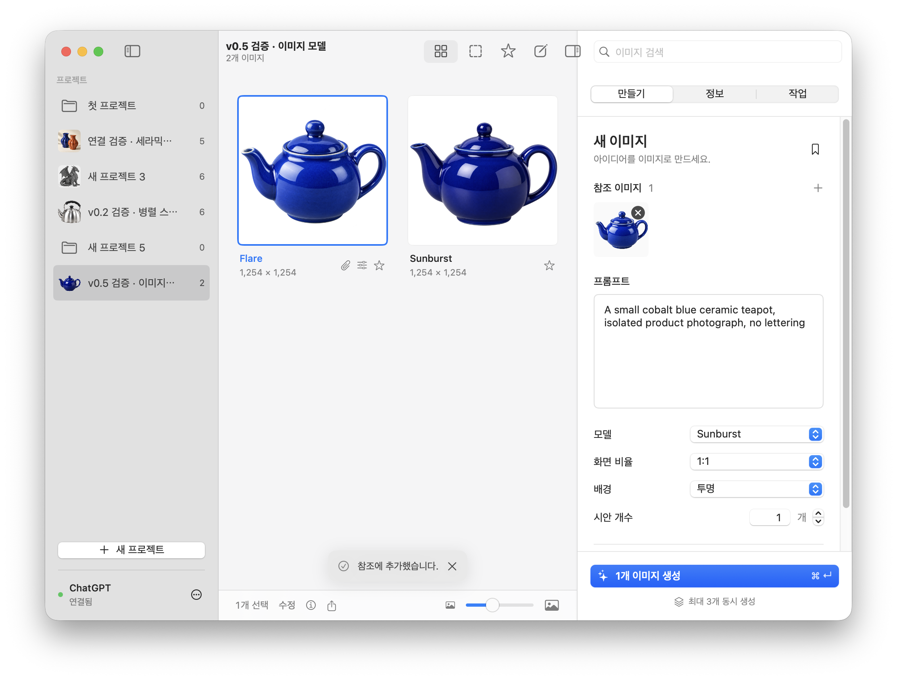

# 0.5 — 모델과 이미지 입력 흐름

2026-09-20, macOS 27.2 / Apple Silicon에서 검증.

## 변경 사항

- 생성 지시문을 자동으로 덧붙이는 대신 ChatGPT의 **+ → 이미지 만들기**를 선택한다. `picture_v2` 멘션의 적용 여부를 준비 단계와 전송 직전에 확인한다. 메뉴 선택 실패 시 전송하지 않고 작업에 오류를 표시한다.
- 모델 선택지는 **Flare / Sunburst**다. 사용자 제공 보고서 13.6~13.7의 최신 실측에 따라 각각 Instant(0), High(2)를 적용한다. 초기값은 Sunburst이고, 마지막 선택은 보관함에 저장해 새 프로젝트와 앱 재실행에서도 유지한다. 이전 작업의 추론 값은 기록 호환성을 위해 보존한다.
- 화면 비율은 `size:1:1` 형식, 배경은 `transparent_background: true` / `false`로 추가한다. 각 설정이 자동이면 해당 문구를 생략한다. 배경 설정도 프로젝트와 레시피에 저장한다.
- 파일 드롭으로 참조를 추가할 수 있는 곳을 **참조 이미지 영역**으로 한정한다. 컬렉션·캔버스·프롬프트 입력창에 놓는 동작은 첨부를 실행하지 않는다. 명시적인 + 버튼, 클립 버튼, 붙여넣기는 기존대로 사용할 수 있다.
- 확인 알림에 닫기 버튼을 추가한다. 작업의 상태와 오류·답변은 그대로 보존하며, 상태가 새로 바뀌면 다시 알린다.
- 하단 알림을 검사기 밖의 주 작업 영역에 부착해 중앙 정렬한다.
- 시안 개수는 숫자 입력란과 스테퍼로 1~50개를 지정한다. 변형별 생성과 이미지 수정에서는 자동 계산한 개수를 표시한다.
- 네이티브 통합 도구 막대의 별도 배경을 숨겨 콘텐츠와 사이드바의 경계가 위까지 이어지도록 했다. 창 제목과 표준 도구 막대 동작은 유지한다.

모델 이름과 내부 설정의 매핑은 해당 계정의 관찰 결과에 기반한다. 추론 값이 커질수록 이미지 품질이 높아진다는 가정은 사용하지 않는다. 서비스 라우팅 변경 가능성과 반환 이미지의 실제 크기·투명도는 별개다.

## 검증

- `swift test`: 26개 통과. 원문 프롬프트 보존, 자동 옵션 생략, 영문 옵션 조합, 모델 스냅샷·설정 저장, 이전 데이터 호환성, 알림 닫기, 한국어/영어 이미지 메뉴와 모드 없는 전송 차단 포함.
- `./script/build_and_run.sh --verify`: 앱 번들 빌드·실행 성공.
- 로그인된 실제 WKWebView에서 Flare(0), Sunburst(2)를 각각 준비하고 이미지 만들기 멘션과 원문·옵션이 함께 남는지 확인.
- 두 모델로 각각 1장 실제 생성. 두 작업 모두 `saved`, 1254 × 1254 PNG, 알파 채널 포함. 해당 검증은 실제 적용한 UI 설정과 결과 저장을 확인하며, 내부 생성 모델의 메타데이터를 별도 조회한 검증은 아니다.
- 실제 마우스 드래그: 이미지를 제자리에 놓기 → 첨부 없음, 프롬프트 입력창에 놓기 → 첨부 없음, 참조 영역에 놓기 → 한 번 첨부. 테스트 참조는 제거해 기존 상태로 복원.
- 키보드로 개수 12 입력·적용 후 원래 1로 복원. Flare 선택 후 앱 재실행에서도 유지 확인. 검증 후 Sunburst 선택.
- 확인 알림 × 동작 및 작업 기록 보존 확인.
- 1000 × 680 밝은 모드와 1100 × 760 어두운 모드에서 레이아웃 확인. 하단 알림이 주 작업 영역 중앙에 표시되고, 사이드바 경계가 상단까지 이어짐을 확인.

실제 계정 세션과 DOM 진단, 생성 원본은 Git에 포함하지 않는다.
